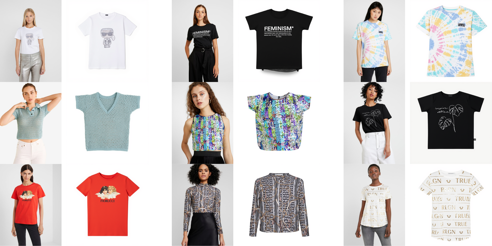

# kontext-vtoff

A LoRA training pipeline for FLUX.1-Kontext model specialized in [Virtual try-off (VTOFF) task][1]. This project enables training custom LoRA adapters to extract garments from clothing images, transforming them into clean product photography with white backgrounds.



## Results
The trained model demonstrates promising performance in extracting garments from worn clothing and generating clean product photography. While the current results show realistic and high-quality outputs, there are opportunities for improvement through:

- **Larger dataset**: The current model is trained on 50 garment/model image pairs
- **Extended training**: Training for more than the current 1,000 steps
- **Dataset diversity**: Including more varied garment types, poses, and lighting conditions
- **LoRA configuration tuning**: Experimenting with different rank values, LoRA alpha, dropout rates, and other hyperparameters.

## Usage

If on a server, you may need to install `conda`, or alternatively `miniconda`:
```bash
wget https://repo.anaconda.com/miniconda/Miniconda3-latest-Linux-x86_64.sh
bash ~/Miniconda3-latest-Linux-x86_64.sh
```

Create a new Conda environment:
```bash
conda create -n kontext python=3.11
conda activate kontext
```
Then, clone this repository:
```bash
git clone https://github.com/rizavelioglu/kontext-vtoff.git
cd kontext-vtoff
pip install -r requirements.txt
```

Login to your HuggingFace account via cli, which is necessary to download FLUX model:
```bash
hf auth login
```

Start training with a single-GPU (`#gpu-poor`):
```bash
python train.py \
  --pretrained_model_name_or_path=black-forest-labs/FLUX.1-Kontext-dev  \
  --vae_encode_mode="mode" \
  --output_dir="./flux-kontext-lora/" \
  --dataset_name="./data/training/" \
  --image_column="end" \
  --cond_image_column="start" \
  --caption_column="instruction" \
  --repeats=1 \
  --max_sequence_length=512 \
  --num_validation_images=4 \
  --validation_epochs=50 \
  --rank=16 \
  --lora_alpha=4 \
  --lora_dropout=0.0 \
  --seed=42 \
  --resolution=1024 \
  --train_batch_size=1 \
  --sample_batch_size=1 \
  --max_train_steps=1000 \
  --checkpointing_steps=500 \
  --gradient_accumulation_steps=1 \
  --gradient_checkpointing \
  --learning_rate=1e-4 \
  --guidance_scale=1 \
  --lr_scheduler="constant" \
  --lr_warmup_steps=200 \
  --dataloader_num_workers=0 \
  --optimizer="adamw" \
  --use_8bit_adam \
  --adam_beta1=0.9 \
  --adam_beta2=0.999 \
  --adam_weight_decay=1e-4 \
  --adam_epsilon=1e-8 \
  --logging_dir="logs" \
  --allow_tf32 \
  --mixed_precision="bf16"
```

> Training on a single H100 takes ~40 minutes with the above arguments.

Run inference with:
```bash
python inference.py --input_folder "./data/testing/" --output_folder "./output/" --lora_folder "./flux-kontext-lora"
```

> Inference on a single H100 takes ~15 seconds per image.

## Acknowledgments
We thank [fal.ai](https://fal.ai) for their supervision and for providing the computational hardware that made this project possible.

<!-- References -->
[1]: https://github.com/rizavelioglu/awesome-virtual-try-off
